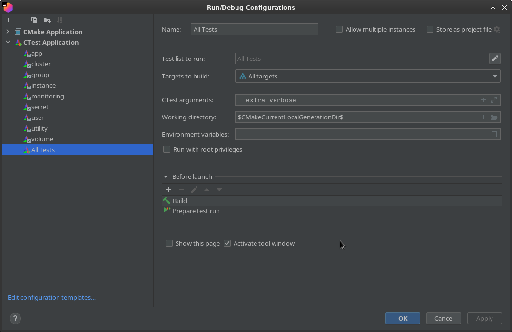

# Running the server tests

## Overview

The server code comes with a test suite of what are not really ideal unit tests, but should provide fairly good coverage of the API methods. Unfortunately, the tests are slightly picky about the environment they need in order to run, due to the many moving pieces involved in having the server do anything useful. The environment needs to have:

- A local installation of DynamoDB, which in turn requires java
- The $`DYNAMODB_JAR` environment variable set to the path of DynamoDBLocal.jar
- The $`DYNAMODB_LIB` environment variable set to the path of DynamoDBLocal_lib directory
- minikube, in order to run a minimal kubernetes cluster

With these components, `make check` or `ctest` run in the build directory should be able to run the tests. The `-j` flag to `ctest` can be used to run several tests in parallel, but it should be noted that the maximum number of tests to be run should usually be _half_ the number of logical cores available on the system due to the high overhead of running a DynamoDB/java instance for each test.

The tests will use whatever Kubernetes environment is currently available, so be careful that your config/context is set appropriately before running the tests. A typically configured minikube instance (2 virtual cores, 2 GB of RAM) may experience difficulties running more than two tests concurrently.

In some cases it may be desirable to run a test directly without `ctest` as an intermediary. To do this one must manually run the `test/init_test_env.sh` script, which starts minikube if necessary, starts the test helm repository, and runs the `slate-test-database-server` daemon, which coordinates starting DynamoDB instances and assigning ports for the various servers run during testing. When testing is complete the `test/clean_test_env.sh` script should be run to stop minikube if it was started by init_test_env.sh and to stop the database-server.

## Local development

In order to facilitate ease of local development, the team has created several containers and [JetBrains CLion](https://www.jetbrains.com/clion/) tools. Feel free to do your own thing instead but note that support from the group may be somewhat limited.

### Requirements

1. A Linux/Unix x86-based host. If your localhost does not meet this requirement (e.g. an M1 Mac), refer to [slateci/cloudlabprofile-localdev](https://github.com/slateci/cloudlabprofile-localdev) to access a temporary Ubuntu remote host as a CloudLab experiment.
   * For those running Windows, take a look at the [Windows Subsystem for Linux (WSL2)](https://learn.microsoft.com/en-us/windows/wsl/install). It is a fantastic tool for developing in a Linux environment "natively" on Windows.
2. A local installation of either:
    * `podman`, `podman-compose`, and `minikube` or
    * `docker` and `docker-compose` (pre-installed in the CloudLab experiment)

### (Optional) Configure/connect CLion to remote host

If you are using a remote host on CloudLab or elsewhere, configure CLion for remote development on that host by choosing **[ File] --> [ Remote Development ]**.

1. Create a new connection.
2. Click the gear icon and fill out the connection details. For example:
   
   

3. Finish the connection wizard in CLion where the project path is:
   ```text
   /users/<cloudlab user>/checkout/
   ```
   and CLion should open the project in a new window.

### Running Tests

1. In a shell on your host, start up the containerized local development environment at the root of this repository.
   ```shell
   $ cd ./clion
   $ ./start_minikube.sh
   $ cd ..
   $ podman-compose -f podman-compose.yml up
   ```
   or if you are using Docker:
   ```shell
   $ docker compose up
   ```
   At this point Kubernetes and the local development container (`clionremote`) should be active.

2. Open CLion and prepare the toolchain settings for `clionremote`.
   
   | Field | Value |
   |-------| ----  |
   | username | `root` |
   | password | `password` |
   | port | `2222` |

   If configured successfully you should see a dialog with green checkmarks. For example:
   
   

3. Prepare the CMake settings for use with the newly created toolchain.

   | Field                    | Value |
   | --- | --- |
   | Build type               | `Debug` |
   | Reload CMake project on editing... | yes |
   | Toolchain                | `clionremote` |

   

4. Configure the mapped deployment path for `clionremote`:
   
   | Field | Value |
   | --- | --- |
   | Deployment path     | `/tmp/work` |

   

5. Configure `rsync` to use old arguments:

   | Field | Value          |
   |----------------| --- |
   | Rsync options     | `-zar,--old-args` |

   

6. Close the **Settings** dialog and build the project by choosing **[ Build ] --> [ Build the Project ]** in the primary CLion toolbar.
   * A successful build will look something like:

     

   * If CLion complains about the following files not being executable in the container:
      * `/tmp/work/cmake/embed_version.sh`
      * `/tmp/work/cmake/extract_version.sh`
      * `/tmp/work/test/init_test_env.sh`
      * `/tmp/work/test/clean_test_env.sh`

     SSH into `clionremote` and manually make them executable. E.g.
     ```shell
     $ ssh root@localhost -p 2222
     (clionremote) # cd /tmp/work/cmake
     (clionremote) # chmod +x *.sh
     (clionremote) # cd /tmp/work/test
     (clionremote) # chmod +x *.sh
     ```

     and try again. Hopefully this step is only necessary once each time `clionremote` is created and when using `rsync`. Otherwise, you may have to repeat it for each subsequent build.
     
   * If CMake still complains about `no reply dir found` even after the `rsync` option tweaks, try choosing not to use `rsync` in the deployment connection settings.
     
     

7. Open the **Run/Debug configurations** dialog and create a new CTest application **All Tests** entry if **All CTest** is not already present.
   
   

8. Run the new configuration and view in the **Run** panel (expand from the bottom of the CLion window)
   * If you receive a "permission denied" the first go-around, click the green Run icon at the top left of the **Run** panel again.
   * If successful, output resembling the following will be displayed.
     
     

9. Alternatively run pre-defined groups of tests (stored in this repo at `./clion/runConfigurations`).
   
   

### Teardown

1. If you have connected CLion to CloudLab or another remote host close CLion first. This will help prevent issues when the toolchain's container is removed.
2. In a shell on your host:
   ```shell
   $ cd ./clion
   $ ./delete_minikube.sh
   $ cd ..
   $ podman-compose -f podman-compose.yml down
   ```
   or if you are using Docker:
   ```shell
   $ docker compose down
   ```
3. You may also find it necessary to forcibly remove `podman` and `docker` volumes as well.
   * [podman volume prune](https://docs.podman.io/en/latest/markdown/podman-volume-prune.1.html)
   * [docker volume prune](https://docs.docker.com/engine/reference/commandline/volume_prune/)

## Profiling the built binaries

> **_IMPORTANT:_** Remember to set `sysctl` back when you are done profiling the SLATE binaries.

In order to run `perf` in the container, you will need to run `clionremote` with elevated privileges.

1. On your host:
   ```shell
   sysctl -w kernel.perf_event_paranoid=1
   ```
   as **root**.
2. Run the following on your host at the root of this repository:
   ```shell
   $ podman build \
       --file ./resources/docker/clion_remote.Dockerfile \
       --tag clionremote:local .
   $ podman run -d \
       --privileged \
       --cap-add sys_ptrace \
       --cap-add SYS_ADMIN \
       -p127.0.0.1:2222:22 \
       -p127.0.0.1:18080:18080 \
       --security-opt seccomp=./resources/perf.json \
       clionremote:local
   ```
   substituting `podman` for `docker` if necessary.
3. The `./resources/docker/perf.json` file should allow you to run `perf` and get profiling on SLATE components within the container.
